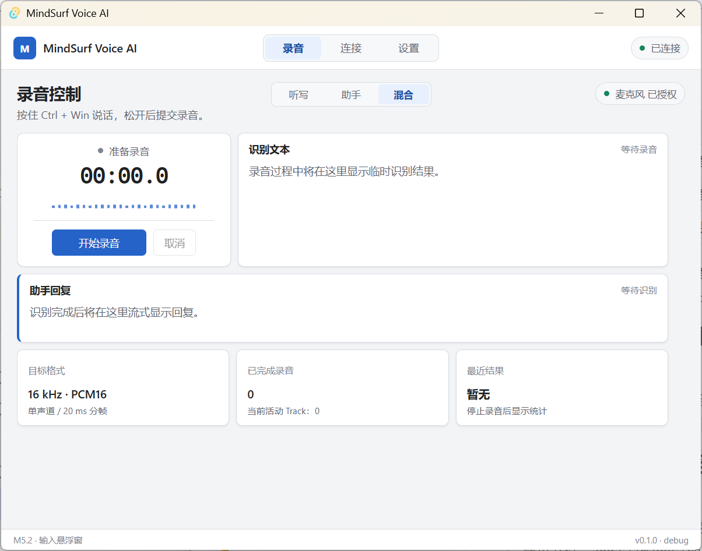
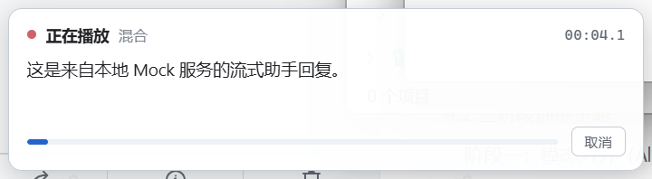

# MindSurf Voice AI 客户端交付说明

> 更新日期：2026-08-04
> 交付范围：Phase 2 M1-M4 Windows/macOS 客户端及联调 Mock

## 1. 交付定位

本仓库交付 MindSurf Voice AI 系统中的客户端，负责用户交互、麦克风采集、音频上传、结果展示、文本注入和语音播放。

仓库中的 Mock 服务用于客户端开发和接口验证。

## 2. 技术栈

| 模块 | 技术 |
|---|---|
| 桌面框架 | Tauri 2、Rust 2021 |
| 前端 | Vue 3、TypeScript、Vite |
| 原生桌面能力 | Windows API、macOS CoreGraphics/AppKit/Accessibility、Carbon 全局热键、文本注入 |
| 音频处理 | Web Audio API、AVAudioRecorder（macOS 原生）、重采样、PCM16 编码与分帧 |
| 通信协议 | WebSocket、自定义 `mindsurf.voice.v1` 协议 |
| 配置与凭据 | Tauri Store、AES-256-GCM、系统钥匙串 |
| 本地 Mock | Node.js、`ws`、FFmpeg |
| 工程质量 | Vitest、ESLint、Prettier、vue-tsc、Cargo |

## 3. 客户端功能介绍

客户端提供三种工作模式：

| 模式 | 说明 |
|---|---|
| 听写模式 | 将语音识别为文字，并注入当前光标位置 |
| 助手模式 | 将语音作为问题，流式展示并播放助手回复 |
| 混合模式 | 同时保留识别文本和助手回复 |

默认按住快捷键开始录音，松开后提交；按 `Escape` 可以取消当前请求。客户端还提供连接状态、录音悬浮窗、音量反馈、系统托盘、中英文界面切换和快捷键录入配置。





## 4. 客户端已实现

- Tauri + Vue 桌面应用基础框架。
- 听写、助手、混合三种模式及请求状态机管理。
- 浏览器 AudioWorklet 与 macOS AVAudioRecorder 原生双录音后端。
- 麦克风采集、音量计算、16 kHz 单声道 PCM16 重采样与 20 ms 分帧。
- WebSocket 握手、控制消息、二进制音频帧、心跳、超时和自动重连。
- 多服务档案的新建、复制、切换、删除、自动连接、连通性测试及本机 `ws://`/远程 `wss://` 安全校验。
- Bearer Token 应用层鉴权、AES-256-GCM 加密落盘及鉴权失败停止重连。
- Windows/macOS 多麦克风输入、识别语言、语音回复开关、音色和播放音量配置。
- 连接、请求、设置和诊断状态域拆分，以及 VoiceRequestController/RecordingController/OverlaySyncController 编排。
- 请求关键节点时间线、阶段耗时、音频收发/underrun/重连摘要和唯一终态跟踪。
- Rust 结构化文件日志、5 MiB x 5 文件轮转、时间/级别/模块筛选、清理和脱敏 ZIP 诊断导出。
- ASR 与 LLM 文本的流式接收和展示。
- TTS 音频分片缓冲、连续播放和停止。
- Windows/macOS 全局按住说话快捷键及快捷键实际按键录入、规范化、冲突检查与注册失败回滚。
- Windows SendInput Unicode 文本注入。
- macOS Accessibility API 与 CGEvent Unicode 文本注入及权限引导。
- macOS 跨 Space 非激活悬浮窗、菜单栏托盘和多显示器定位。
- macOS 原生 AVAudioRecorder 录音及原生电平表。
- 中英文界面语言切换及应用菜单、托盘菜单本地化。
- 录音悬浮窗、系统托盘、权限和错误提示。
- 请求提交、取消及断线后的状态清理。
- 遵循当前协议的本地 Mock 服务及测试音频输出。
- Mock 19 类可配置故障注入（握手/鉴权/推理/协议/连接异常）。
- 前端音频、协议、状态机、设置校验、文本注入、WebSocket 和控制器集成测试。
- Rust Token 加解密、日志轮转/脱敏、快捷键解析和文本注入单元测试。

## 5. 客户端待实现

- 接入正式服务端凭据签发与轮换流程。
- 按需求进行 Linux 跨平台适配。
- 接入正式服务地址，替换本地 Mock。
- 配置正式升级服务地址和更新签名公钥。
- 使用正式 Apple Developer 凭据完成签名、公证及发布验证。

## 6. 交付内容

```text
mindsurf-voice-ai/               Tauri 桌面客户端源码
mindsurf-voice-mock/             客户端联调用 WebSocket Mock
README.md                        项目启动说明
docs/DELIVERY.md                 客户端交付说明（本文件）
docs/MACOS.md                    macOS 适配与发布说明
docs/WS_PROTOCOL.md              WebSocket 协议
docs/PHASE1_IMPLEMENTATION.md    Phase 1 实现基线
docs/PHASE2_IMPLEMENTATION.md    Phase 2 实施计划与状态
```

运行方法及环境要求见 [`README.md`](../README.md)，接口说明见 [`WS_PROTOCOL.md`](./WS_PROTOCOL.md)。
