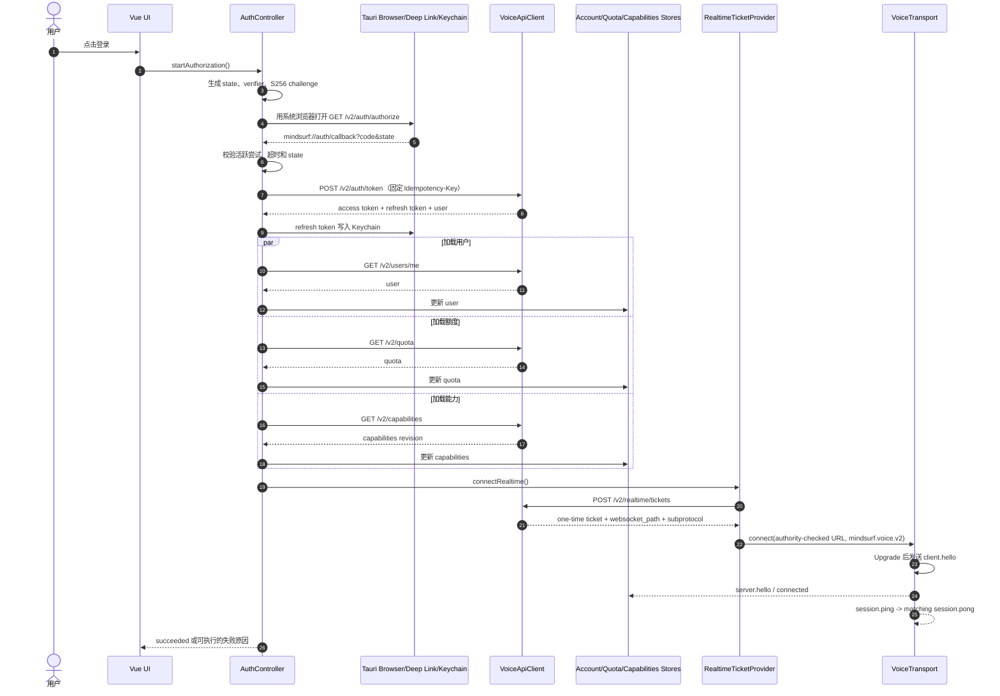
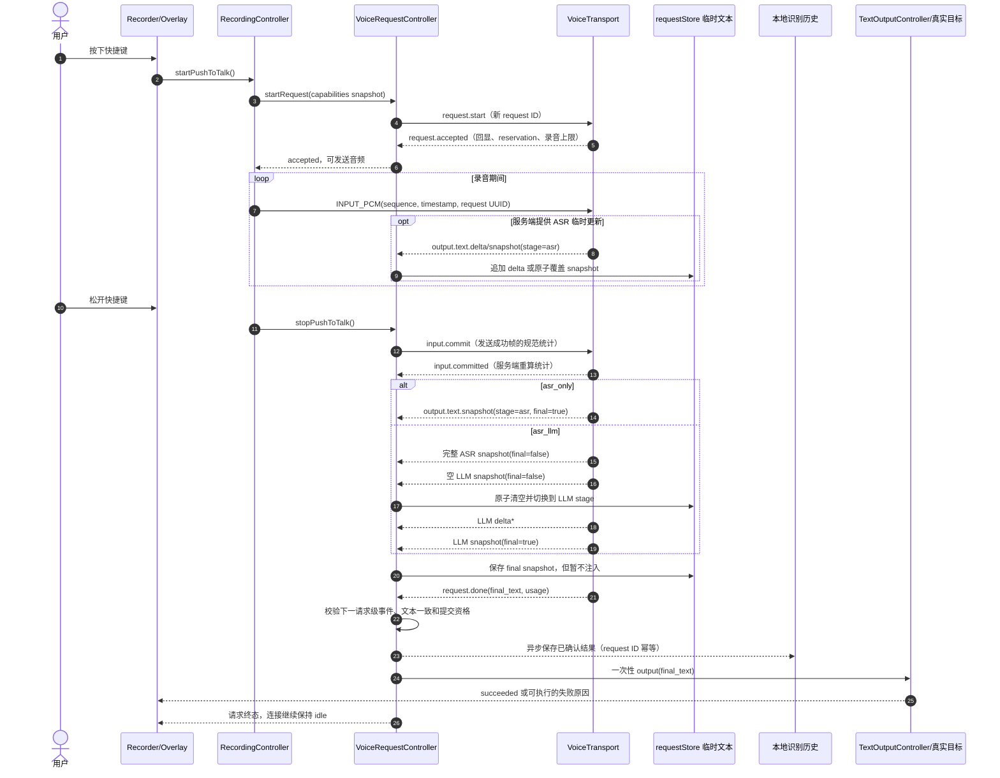

# MindSurf Voice AI Client Phase 3 实现文档

> 制定日期：2026-08-17
>
> 协议基线：`docs/v2/` Frozen 版
>
> 实现基线：当前 Phase 2 客户端与 `mindsurf-voice-mock`
>
> 阶段主题：删除 v1 产品与协议面，完整迁移到 Voice API v2

## 实施状态

| 里程碑 | 状态                                       | 更新日期   | 说明                                                                                                                                                     |
| ------ | ------------------------------------------ | ---------- | -------------------------------------------------------------------------------------------------------------------------------------------------------- |
| M1     | 客户端实现完成，待真实服务与双平台人工签收 | 2026-08-17 | 已实现系统浏览器 PKCE、深链与单实例、Keychain refresh token 轮换、HTTP user/quota/usage/capabilities、严格能力校验、账户 UI 和启动恢复；自动化质量门通过 |
| M2     | 客户端实现完成，待真实服务与双平台人工签收 | 2026-08-17 | 已实现一次性 ticket、安全 WS URL、v2 hello、严格控制消息校验、心跳半开检测、关闭码策略、抖动退避和新 ticket 重连；自动化质量门通过                       |
| M3     | 客户端实现完成，待真实服务与双平台人工签收 | 2026-08-17 | 已实现 v2 单活跃请求、accepted 回显、48 字节 INPUT_PCM、成功发送统计、commit、两阶段临时文本、final/done 双确认、取消竞态和断线撤权；自动化质量门通过    |
| M4     | 客户端实现完成，待 M5 全链路与双平台签收   | 2026-08-17 | 已删除 v1 Transport/Controller/协议类型、下行播放、旧模式、手工服务凭据和相关设置/UI；设置迁移到 schema v2，自动化质量门通过                             |
| M5     | 客户端与 Mock 完成，待跨平台人工签收       | 2026-08-17 | 已实现 HTTP + ticket + WebSocket v2 Mock、故障注入、全链路自动化测试和当前文档清理；Windows/macOS 系统能力与正式服务验收待完成                           |
| M6     | 客户端实现完成，待双平台人工签收           | 2026-08-18 | 已实现按账户隔离的本地识别历史、成功结果落库、搜索筛选、详情操作和隐私清理；自动化质量门与 macOS 调试包构建通过，不改变冻结 Voice API v2 契约            |

M1 实施期间保留现有 v1 WebSocket 服务档案与请求链路，以维持可构建基线；新增的
`voiceApiOrigin`、账户页和 v2 登录态与其隔离。该过渡面将在 M2-M4 按依赖顺序替换和删除，
不构成最终产品的 v1/v2 双栈。HTTP 请求使用 Tauri 原生 HTTP 客户端，避免依赖 WebView CORS；
生产仅允许 HTTPS，本地开发仅允许 loopback HTTP。

M2 使用平台 WebView 的标准 WebSocket API。该 API 在部分平台不会暴露 Upgrade HTTP 响应体，
因此客户端无法可靠区分 Upgrade 阶段的 400/401/403/409/426/429/503；对于未建立连接的未知失败，
客户端始终丢弃原 ticket、退避后申请新 ticket。明确收到 1002/4001 时停止自动重连，收到
1001/1011/4002/4003 时申请新 ticket 恢复。Origin 或子协议配置错误需由服务端使用稳定关闭码
或在人工联调中确认；M5 Mock 与双平台验收需要覆盖这一平台限制。

M3 已将录音、快捷键、悬浮窗和主录音页的实际请求路径切换到 v2。每次请求使用新 UUID，只有
`request.accepted` 后才启动录音；上行帧、commit 统计、ASR/LLM 独立 sequence、空 LLM stage
切换以及 final snapshot 后紧邻 `request.done` 的约束均由客户端状态机校验。取消、请求级错误、
协议顺序错误和断线会永久撤销提交资格，活跃请求不会在重连后重放。旧 v1 Controller、TTS/播放
字段和设置持久化结构暂时保留以维持 M3 可构建迁移点，但已不再参与录音请求；它们连同旧设置页
产品措辞将在 M4 删除。M3 自动化覆盖两种 mode、取消输掉成功竞态、断线、帧向量和零帧 commit；
真实服务联调、macOS/Windows 录音与一次性注入仍需在 M5 人工签收。

M4 已删除客户端生产路径中的 v1 Transport、事件路由、Controller、协议类型和下行播放器，并将
请求、诊断、托盘、悬浮窗、设置与界面统一为 `asr_only` / `asr_llm`。设置仓库升级到 schema v2，
只安全迁移麦克风、快捷键、悬浮窗、开发者选项、语言和文本注入等仍受支持的字段；已移除的长期服务
凭据不会迁移，应用启动时会清空旧凭据文件内容并删除旧加密密钥。v1 Mock、README、Delivery 与
历史文档入口的清理由 M5 与冻结测试向量、全链路联调一并完成。

M5 已完成本仓库可自动化部分：本地 Mock 现提供冻结 OpenAPI 的全部 HTTP 路径、PKCE、幂等 token
交换与 refresh 轮换、账户/额度/用量/能力、一次性 ticket，以及 `mindsurf.voice.v2` 长连接、心跳、
INPUT_PCM 校验、两种文本时序、取消和结算。Mock 提供授权拒绝、响应不确定、凭据重放、能力过期、
ticket 异常、各阶段超时/失败、final/done 不一致、取消竞态和处理中断线等稳定故障注入；自动化测试
覆盖正常 HTTP/WS 全链路、同连接连续请求、ticket 单次消费和关键异常。当前 README、Delivery 和
客户端 README 已只指向 `docs/v2/`，旧 v1 协议文档已删除，Phase 1/2 文档标记为历史记录。
Windows/macOS 的系统浏览器回跳、系统凭据库、原生录音、快捷键、悬浮窗、文本注入和正式签名发布
仍需按交付清单人工签收，因此 Phase 3 尚不标记为跨平台最终完成。

M6 是 v2 迁移完成后的本地产品能力扩展。历史只消费客户端已经通过 final snapshot 与
`request.done` 双确认的成功结果，不新增服务端接口、不改变请求生命周期，也不允许从历史恢复或
复用 request ID。该能力的正文仅保存在当前设备，必须与诊断日志、诊断 ZIP 和服务端用量记录隔离。
客户端实现使用独立 Store、账户级容量与清理策略，并已覆盖成功、取消、断线、损坏数据、幂等、
账户隔离和容量淘汰测试；Windows 与 macOS 的实际交互、文本重新注入和系统级清除仍按人工清单签收。

## 1. 结论与实施原则

当前客户端实现的是 `mindsurf.voice.v1`：直连 WebSocket，在 `client.hello` 中传 Bearer Token，支持
`dictation`、`assistant`、`mixed`、TTS 和下行音频。冻结的 v2 协议则要求系统浏览器 PKCE 授权、
HTTP 账户与能力接口、一次性 ticket、`mindsurf.voice.v2` 长连接，以及仅包含 `asr_only` 和
`asr_llm` 的单轮文本流程。

因此 Phase 3 是一次协议和产品面的替换式迁移，不保留 v1/v2 双栈，不通过兼容别名把 v1 消息
映射成 v2 消息。阶段完成后，客户端、Mock、测试和对外文档只描述 v2。

实施遵守以下原则：

- `docs/v2/openapi/openapi.yaml` 是 HTTP 字段和状态码的权威来源；
- `docs/v2/schemas/` 是 WebSocket JSON 消息的权威来源；
- `docs/v2/docs/WS_PROTOCOL_V2.md` 是二进制布局、连接和时序的权威来源；
- `docs/v2/docs/request-lifecycle.md` 是终态和文本提交语义的权威来源；
- 客户端不得猜测能力、降级模式、复用 request ID、复用 ticket 或重放断线请求；
- 保留 Phase 2 已完成的录音、快捷键、权限、悬浮窗、诊断、设置仓库和直接文本注入架构，
  但删除其上的 v1 协议、Assistant/TTS 和手工 Bearer 配置；
- 协议迁移完成前不增加多轮会话、输入法模式、TTS 或原生音频模型等新产品形态。
- 本地识别历史属于协议终态之后的客户端派生数据，不得反向影响请求成功、结算或文本注入资格。

## 2. Phase 3 范围

### 2.1 阶段目标

1. 实现系统浏览器 + Authorization Code + PKCE 的桌面授权生命周期。
2. 实现 `/v2/users/me`、`/v2/quota`、`/v2/usage`、`/v2/capabilities` 和 realtime ticket。
3. 将现有 WebSocket 传输完整替换为 `mindsurf.voice.v2` 长连接。
4. 将请求模式、状态机和临时文本逻辑替换为 `asr_only` / `asr_llm`。
5. 严格做到 final snapshot 与 `request.done` 双确认后才向真实目标一次性写入文本。
6. 删除 v2 明确排除的 Assistant、Conversation、TTS、下行音频、音色和情绪相关能力。
7. 将本地 Mock 和自动化测试迁移到冻结协议及其测试向量。
8. 更新设置、界面、日志、README 和交付文档，使其不再暴露 v1 概念。
9. 提供按登录账户隔离的本地识别历史，支持查看、搜索、复制、重新注入、单条删除和清空。

### 2.2 非目标

- v1/v2 双协议协商或旧服务兼容开关；
- 多轮 Conversation、Assistant、上下文记忆或 `conversation_id`；
- TTS、音频回复、下行 PCM、音色、情绪和流式播放；
- 在 LLM 失败时自动提交 ASR 文本；
- 断线恢复或重放活跃请求；
- 注册、邮箱验证、找回密码、MFA 等认证页面；这些由系统浏览器中的认证站点处理；
- 后端 v2 的业务实现。本阶段只实现客户端与用于客户端联调的 Mock。
- 历史云同步、跨设备同步、服务端历史接口、音频归档或失败/取消请求归档。

## 3. 当前实现与 v2 的明确不一致

以下内容不是可选优化，而是当前代码与冻结协议直接冲突，必须在 Phase 3 中替换或删除。

### 3.1 协议版本和建连方式

- 当前 `src/types/protocol.ts` 使用 `PROTOCOL_VERSION = 1` 和 `mindsurf.voice.v1`；v2 固定为
  `v=2` 和 `mindsurf.voice.v2`。
- 当前服务档案保存完整 `websocketUrl` 并直接连接；v2 必须保存 HTTP API origin，通过
  `POST /v2/realtime/tickets` 获取本次唯一权威 `websocket_path` 后建连。
- 当前 Bearer Token 放在 `client.hello.auth`；v2 在 Upgrade 前用一次性 ticket 鉴权，
  `client.hello` 不得携带 Bearer Token。
- 当前连接复用固定 URL 自动重连；v2 每次重连必须申请新 ticket，必要时先 refresh access token。
- 当前 `client.hello` 还发送 `pipelines` 和 `output_audio`；v2 hello 只声明客户端、版本列表和
  `pcm_s16le/16000/mono` 输入能力。
- 当前 `server.hello` 读取 `pipeline`、`features`、`inference_options`、`voices` 和嵌套
  `heartbeat`；v2 字段为协商后的 `input_audio`、顶层 heartbeat/idle timeout 和 limits。
- 当前 JSON 上限固定使用本地 `MAX_JSON_BYTES` 并读取 `max_json_bytes`；v2 使用
  `server.hello.limits.max_control_bytes`。

### 3.2 产品模式和能力来源

- 当前公开 `dictation`、`assistant`、`mixed` 三种模式；v2 只允许 `asr_only` 和 `asr_llm`。
- 当前把非听写模式折叠为 `assistant`；v2 的 `asr_llm` 是单轮 ASR 后文本处理，不是 Assistant。
- 当前能力选项来自 `server.hello.inference_options`；v2 必须来自 HTTP
  `GET /v2/capabilities`，并携带同一 `revision` 发起请求。
- 当前支持 `cascade`、`native_audio` 和 `auto` Pipeline 偏好；v2 Pipeline 是能力目录中的
  不透明 ID，客户端不得从名称推断类型或自行 fallback。
- 当前 request.start 使用 `conversation_id`、`response.text/audio/voice`、TTS 和输出音频选择；
  v2 必须发送 `mode`、`pipeline`、`capabilities_revision`、ASR/LLM selection、language 和
  可选 generation。
- 当前 `request.accepted` 不校验 Pipeline、revision、选择回显和额度预留；v2 必须逐字段原样
  校验，并采用 accepted 的 `max_recording_ms` 作为本请求唯一录音上限。

### 3.3 文本事件和真实目标提交

- 当前消费 `asr.partial`、`asr.final`、`assistant.text.delta` 和 `assistant.text.done`；v2 统一为
  `output.text.delta` 和 `output.text.snapshot`。
- 当前 ASR 和 Assistant 各自维护展示字段；v2 为当前请求维护一块临时文本区域，snapshot 必须
  原子覆盖而不是追加。
- 当前听写在 `asr.final` 到达时即可自动注入，助手在 `assistant.text.done` 到达时即可自动注入；
  v2 明确要求 final snapshot 和紧随其后的合法 `request.done` 同时确认后才能一次性写入真实目标。
- 当前未验证 `request.done.final_text` 与 final snapshot 全文完全相等；v2 不一致时必须撤销提交
  并按协议错误关闭连接。
- 当前没有实现 `asr_llm` 的空 LLM snapshot stage 切换，也没有分别校验 ASR/LLM delta sequence。
- 当前允许以最终 ASR 结果直接驱动后续本地注入；v2 的 `asr_llm` ASR snapshot 永远不能提交。
- 当前请求级 terminal error 的处理依赖 `fatal`，非 fatal 错误可能只显示后继续；v2 的请求级
  error 必须是唯一终态并释放请求槽位。

### 3.4 TTS 和下行音频

- 当前协议类型、Transport、Controller、Store 和 UI 都支持 TTS、下行 `OUTPUT_PCM`、音色、
  播放音量和播放器状态；v2 明确不定义这些能力，也不定义任何下行二进制帧。
- 当前收到二进制消息后尝试解码并播放；v2 客户端收到服务端二进制消息应视为协议错误，不能
  继续保留 v1 解码分支。
- 当前存在 `playing` 请求主状态和播放中断行为；v2 请求状态机中没有播放阶段。

### 3.5 取消、终态、错误和重连

- 当前本地状态为 `preparing/recognizing/generating/playing`；v2 权威状态需要表达
  `starting/recording/committing/processing_asr_final/processing_llm/ready_to_commit/cancelling`。
- 当前 final 文本与 `request.done` 之间没有“下一条请求级事件”约束；v2 必须校验该终态锁定规则。
- 当前取消后主要等待 `request.cancelled`；v2 取消可能输给已锁定的 success，客户端要接受最先
  到达的合法唯一终态，但发送 cancel 后无论结果都永久撤销本地提交资格。
- 当前 `ProtocolErrorPayload` 使用 `recoverable`；v2 使用 `terminal`、`retryable`、`fatal`，且
  error scope、stage、usage 和布尔组合受 Schema 严格约束。
- 当前重连延迟、关闭码分类和认证错误仍按 v1；v2 对 1001/1002/1011/4001/4002/4003 规定了
  不同策略，1002 和 4001 不得自动重连。
- 当前任何收到的业务消息都会刷新 heartbeat watchdog；v2 客户端半开检测以 `server.hello` 或
  最近合法 `session.ping` 为基准，普通业务消息不能替代 heartbeat。
- 当前 event ID 集合超过 1024 条时整体清空；长连接上这会允许旧 event ID 再次生效。Phase 3
  必须在整个 WS session 生命周期保留已接收 event ID；达到客户端安全上限时关闭并重建 session，
  不得原地清空集合继续处理，同时对重复事件静默忽略和记录诊断。

### 3.6 设置和凭据

- 当前用户手工录入长期 Bearer Token；v2 必须通过浏览器授权取得 token pair。
- 当前凭据层按“服务档案 + 任意 Token”保存密文；v2 只把 refresh token 放入系统 Keychain，
  access token 只留内存或等价安全存储，不把 token pair 写入普通 Store。
- 当前服务档案字段是 `websocketUrl/authMode/preferredPipeline`；v2 应改为 HTTP API origin，删除
  auth mode 和手工 Pipeline 类型偏好。
- 当前设置持久化 TTS、output audio、voice、audio response 和 playback volume；这些均超出 v2。

## 4. 当前缺少且必须实现的内容

### 4.1 HTTP 与浏览器授权层

- 新增统一 `VoiceApiClient`，严格解析 OpenAPI 的成功信封和 `ErrorResponse`，为受保护接口自动
  附加内存 access token，并对敏感字段执行日志脱敏。
- 新增 `AuthController`：生成至少 32 字节随机 state、RFC 7636 verifier 和 S256 challenge，
  使用系统默认浏览器打开固定 authorize 参数。
- 增加 `mindsurf://auth/callback` 深链、自定义协议注册和单实例转发；仅接受当前内存授权尝试、
  恒定时间匹配 state，丢弃未知、过期、重复或不匹配回跳。
- 授权尝试一次只允许一个，15 分钟超时；新授权、超时和退出都清除 state/verifier。
- `/v2/auth/token` 与 `/v2/auth/refresh` 实现 UUID `Idempotency-Key` 和“同一逻辑操作复用同一
  key + 完全相同 body”的不确定结果恢复规则。
- refresh token 原子轮换后写入系统 Keychain；实现 `idempotency_result_expired`、
  `refresh_token_reused` 和两分钟不可确认结果的重新登录路径。
- 实现 logout：调用 `/v2/auth/logout`，并在成功、已撤销或放弃重试后清理 Keychain、内存 token、
  user、quota、capabilities、ticket 和现有 WebSocket。
- 授权后并行加载 `/v2/users/me`、`/v2/quota` 和 `/v2/capabilities`；已有 refresh token 的启动
  路径必须先 refresh，不打开浏览器。
- 实现 `/v2/usage` 半开时间区间和不透明 cursor 分页，分页期间保持首次查询参数不变。

### 4.2 账户、额度和能力状态

- 新增 `authStore/accountStore`：仅保存界面需要的登录状态和用户资料，不保存明文 token。
- 新增 `quotaStore`：展示 credits limit/used/reserved/remaining 和服务端原始 usage，不在客户端
  自行换算 credits。
- 新增 `capabilitiesStore` 及严格校验器：校验 protocol version、revision、唯一 ID、引用完整性、
  mode/default selection、generation control 范围和 realtime 常量。
- capabilities 不合法时整份 revision 失效，禁止发请求；收到 `capabilities_stale` 或
  `pipeline_unavailable` 时刷新能力，并在可观察选择变化后要求用户确认，不静默 fallback。
- request terminal 后用返回 usage 更新本次展示，并异步刷新 HTTP quota；HTTP quota 始终是账户
  汇总权威来源。

### 4.3 Ticket 与长期 WebSocket

- 新增 ticket provider：每次连接调用 `/v2/realtime/tickets`，检查过期时间和子协议。
- 只使用 ticket 响应 `websocket_path`；以签发 ticket 的 API origin 为 authority，将 https/http
  映射为 wss/ws，拒绝跨 authority 路径，并对 ticket query 做 percent encoding。
- 为 Upgrade 失败实现 400/401/403/409/426/429/503 的稳定策略；ticket 无效、过期或已消费时
  申请新 ticket，Origin/子协议配置错误和账户 suspended 不自动重试。
- hello 完成前禁止录音、请求和音频；取得 token 后立即预连接，请求终态后回到 idle 并保持连接。
- 实现 v2 心跳：立即回相同 nonce 的 pong，只按合法 ping 更新 watchdog；检测半开连接后主动关闭。
- 重连采用 250 ms、500 ms、1 s、2 s、最高 5 s 加抖动；不得恢复活跃请求或复用 request ID。
- 对控制消息执行 Schema 等价的严格校验：顶层未知字段拒绝、payload 未知非关键字段忽略、
  request/session scope 校验、事件去重和请求顺序校验。

### 4.4 v2 请求和二进制上行

- 每次逻辑请求生成新的 UUID（推荐 UUIDv7），包括重试、重连和同一录音再次提交；不提供
  “重试旧 request ID”或从历史记录恢复 request ID 的路径。
- `request.start` 使用 capabilities 同一 revision 中的 mode、Pipeline、selection、language 和
  generation；`asr_only` 强制 llm=null 且省略 generation。
- accepted 前不发送 INPUT_PCM；accepted 后逐字段验证原样回显、quota reservation 合计，并校验
  `max_recording_ms = min(server.hello 上限, selected Pipeline 上限)`；录音上限立即切换为 accepted 值。
- 输入帧固定为 48 字节 v2 header，sequence 从 0 连续递增，timestamp 使用累计样本数公式，
  payload 为正偶数字节且不超过 `max_binary_bytes`。
- commit 基于实际发送成功的帧计算 `last_sequence/chunk_count/sample_count/duration_ms`，禁止零帧
  commit；发送 commit 后禁止继续发送音频。
- 校验 `input.committed` 是服务端重算的规范统计且与本地一致；不一致由请求级 terminal 结束。
- 根据 accepted 后最后合法帧维护 input idle timeout 的本地展示和防护，但服务端 terminal 是
  结算权威。

### 4.5 临时文本和唯一提交资格

- requestStore 改为单一 `temporaryText`、当前 `stage`、ASR/LLM 各自 next sequence、
  `finalSnapshotText`、`commitEligible` 和 `cancelRequested`。
- delta 只能追加到当前 stage；snapshot 全量原子覆盖，且不重置该 stage sequence。
- `asr_only` 在 input.committed 后只接受 ASR `final=true` 收口；`asr_llm` 的 ASR snapshot 必须
  `final=false`，随后必须由空的 LLM snapshot 原子清空并切换 stage。
- final snapshot 到达时只进入 `ready_to_commit`，不得注入；仅当同 request ID 下一条请求级事件
  是合法 `request.done`、mode 正确、final_text 完全一致且期间没有取消/error/断线，才调用一次
  `TextOutputController.output`。
- 发送 cancel、terminal error、断线或任何终态顺序错误时立即且永久撤销提交资格；临时文本可留
  在 UI 中用于解释失败，但不能自动或手动以“完成结果”提交。
- LLM 失败不得自动降级为 ASR 结果。若用户需要 ASR 文本，只能选择 `asr_only` 以新 ID 重试。

### 4.6 统一操作反馈和重复操作防护

- 新增统一 `OperationFeedback`/Toast 服务，所有由用户主动触发且会产生外部效果的异步操作都必须
  进入 `pending -> succeeded | failed | cancelled` 状态，不能只在控制台或诊断日志中记录结果。
- 覆盖范围至少包括：登录、登出、刷新登录态、服务地址保存、连接测试、建立/重建连接、设置保存、
  快捷键注册、权限操作、日志导出、录音或测试音频保存、清除本地数据和文本注入重试。
- 操作开始后，对同一资源具有副作用的按钮必须禁用或复用同一个 in-flight Promise；不得因连续点击
  重复创建文件、重复发起浏览器授权、重复登出或并行申请多条连接。只读刷新可以合并请求，但不能
  用旧响应覆盖较新的状态。
- 成功反馈应说明完成的动作；文件导出或保存成功时应返回并展示最终文件名或脱敏路径，并提供“打开
  所在位置”等明确后续动作。取消文件选择等用户主动取消使用中性反馈，不显示为错误。
- 失败反馈必须展示面向用户的简短原因和可执行的下一步；稳定 HTTP/WS/本地错误码映射为本地化文案，
  未知错误保留可复制的脱敏诊断 ID。UI 不直接展示服务端堆栈、原始响应体或敏感 details。
- Toast 不是唯一状态来源：登录、连接、导出等长操作必须同时在原控件附近保留可访问状态；Toast
  使用 `aria-live`，不会因页面切换导致操作结果完全丢失。
- feedback、日志和诊断 ZIP 均不得包含 Authorization Code、PKCE verifier、access/refresh token、
  ticket、密码或完整文本正文。重复点击被合并时可以记录脱敏诊断，但不重复弹出成功提示。

### 4.7 本地识别历史

- 新增独立“历史”一级页面，位于原“权限”标签位置；权限页继续作为设置内二级页面，并可从录音页
  权限汇总入口进入。
- 历史只在合法 final snapshot 与紧邻的 `request.done` 完成双确认后写入。取消、失败、断线、协议
  错误、文本不一致或已撤销提交资格的请求不得产生记录。
- 每条记录使用原 request ID 作为本地幂等键，并保存 `user_id`、完成时间、mode、language、Pipeline、
  录音时长、最终结果；`asr_llm` 额外保存进入 LLM stage 前最后一份完整 ASR snapshot 作为原文。
- 历史不得保存音频、临时 delta、token、ticket、登录名或服务端错误 details；历史正文不得进入普通
  诊断日志和诊断 ZIP。
- 使用独立 `recognition-history.json` Store，不与设置 Store 混写。按 `user_id` 查询和清空，退出登录
  不删除本地历史；“清除本地数据”删除设备上的全部账户历史。
- 同一账户最多保留最近 500 条，新增时按完成时间淘汰最旧记录；读取时对持久化数据执行类型、长度、
  mode 和时间戳校验，损坏条目跳过而不阻塞其余历史。
- 历史页提供正文搜索、全部/识别/润色筛选、日期分组、详情、复制、重新注入、单条删除和当前账户
  清空。重新注入是新的本地外部效果，不创建服务端请求，必须复用文本输出的长度限制和操作反馈。
- 历史写入不得阻塞或改变请求终态。写入失败只更新历史存储错误和脱敏诊断，不能把已完成请求改为
  failed，也不能重复执行文本注入。

## 5. 必须删除的内容

### 5.1 删除产品与 UI 能力

- 删除 `assistant`、`mixed` 模式及“助手”产品措辞，替换为“仅识别”和“ASR + LLM 文本处理”。
- 删除语音回复开关、voice 选择、播放音量、播放卡片、首音频/首播指标和播放中断按钮。
- 删除 TTS、output audio、voice 的模型选择和所有相关设置持久化字段。
- 删除服务档案中的手工 Bearer Token 输入/清除、`authMode`、完整 WebSocket URL 和
  `preferredPipeline` 类型选择；改为 API origin、登录状态和 capabilities 中的实际 Pipeline。
- 删除 README、Delivery、Mock README 和界面中的 v1 URL、`cascade/native_audio`、Assistant、
  TTS 与“19 类 v1 故障”说明。

### 5.2 删除代码与协议类型

- 删除 `OutputAudioOption`、`OutputAudioFrame`、`OutputAudioStart/Done`、
  `AssistantTextDelta/Done`、v1 `AsrPartial/Final` 等协议类型。
- 删除 `OUTPUT_AUDIO_KIND`、`decodeOutputAudioFrame`、`validateOutputAudioStart/Done` 和所有服务端
  二进制播放分支；保留并升级 INPUT_PCM 编码。
- 删除 `src/audio/streamingPlayer.ts` 及其测试；确认没有录音侧引用后删除仅供下行播放使用的
  PCM 工具。录音和重采样代码继续保留。
- 删除 requestStore 的 assistant、playback、warning 和播放 metrics 字段及相应 actions。
- 删除 VoiceRequestController 的 player、TTS 容错、audio frame callbacks、`playing` 状态和
  `interruptPlayback`。
- 删除设置 Store/Repository/Controller 中 `audioResponseEnabled`、`voice`、`playbackVolume`、
  `ttsId` 和 `outputAudioId`。
- 删除 `conversation_id`、`response.wants/voice`、`pipelines:[cascade]` 和 hello 内 Bearer auth。
- 删除 v1 Mock 的 `/v1/voice/ws`、v1 子协议、TTS 生成和所有 v1 专属 fault。

### 5.3 删除或归档旧文档

- Phase 3 完成时删除 `docs/WS_PROTOCOL.md` 这份 v1 协议，避免与冻结 v2 并存成为错误入口。
- `PHASE1_IMPLEMENTATION.md` 和 `PHASE2_IMPLEMENTATION.md` 可保留为历史实施记录，但需在顶部
  标注其协议和产品范围已被 Phase 3 取代。
- 根 README、客户端 README 和 `docs/DELIVERY.md` 只链接 `docs/v2/`，不得继续把 v1 描述为当前能力。

## 6. 目标模块边界与实施时序

### 6.1 模块边界

```text
Vue Components
  -> AuthController / VoiceRequestController / RecordingController / HistoryController
      -> authStore / accountStore / quotaStore / capabilitiesStore
      -> connectionStore / requestStore / settingsStore / diagnosticsStore
      -> historyStore / RecognitionHistoryRepository
      -> VoiceApiClient / TokenManager / RealtimeTicketProvider
      -> VoiceTransport / ProtocolEventRouter / TextOutputController
          -> Tauri deep-link + single-instance + system browser + Keychain
```

- `VoiceApiClient` 只负责 HTTP 契约、错误解析和 access token 注入。
- `TokenManager` 只负责内存 access token、Keychain refresh token、轮换和幂等恢复。
- `RealtimeTicketProvider` 只负责申请一次性 ticket 和安全构造 WebSocket URL。
- `VoiceTransport` 只负责 Upgrade、hello、heartbeat、重连、收发和 Schema 校验。
- `ProtocolEventRouter` 负责 event ID 去重、scope、request ID 和终态后的事件拒绝。
- `VoiceRequestController` 负责请求状态、临时文本和提交资格，不直接管理底层 socket。
- `TextOutputController` 只能由成功 `request.done` 路径调用，不接受中间 ASR/LLM 事件直接调用。
- `RecognitionHistoryRepository` 只负责本地历史校验、幂等写入、账户过滤、容量淘汰和删除；不访问
  Voice API，不拥有请求终态。

### 6.2 登录、初始化和长期连接时序

本图只描述客户端模块分工，HTTP 路径、字段和错误仍以 `docs/v2/openapi/openapi.yaml` 为准：



已有 refresh token 的启动路径跳过浏览器，先由 `AuthController` 调用 `/v2/auth/refresh` 完成轮换，
再进入三个 GET 和 ticket 建连。任一操作处于 pending 时，UI 必须应用 4.6 的重复操作防护。

### 6.3 单轮语音请求和最终提交时序

本图对应 `docs/v2/docs/WS_PROTOCOL_V2.md` 和 `docs/v2/docs/request-lifecycle.md`，不另行定义消息字段：



`request.cancel`、请求级 terminal error 或连接断开可以从任一非终态发生；对应路径必须停止发送音频、
撤销提交资格、清理本地资源并给出操作反馈，不得调用 `TextOutputController.output`。

## 7. 实施里程碑

| 里程碑 | 内容                                      | 完成门槛                                         |
| ------ | ----------------------------------------- | ------------------------------------------------ |
| M1     | HTTP、PKCE、深链、Keychain token 生命周期 | 可登录、刷新、登出并加载 user/quota/capabilities |
| M2     | ticket、v2 hello、心跳和长期连接          | 空闲长连接稳定，关闭码与 ticket 重连策略通过测试 |
| M3     | v2 请求、上行音频、状态机和临时文本       | 两种 mode 正常、取消、失败、断线均只有一个终态   |
| M4     | 删除 TTS/Assistant/v1 设置和 UI           | 生产代码中无 v1 public surface 或 v2 禁止概念    |
| M5     | v2 Mock、测试向量、跨平台验收和文档       | 自动化质量门与 Windows/macOS 人工清单通过        |
| M6     | 本地识别历史、页面与隐私清理              | 成功结果唯一落库，账户隔离、容量和清理测试通过   |

里程碑顺序不能颠倒：请求实现依赖有效 capabilities 和已认证长连接；删除旧 UI 可与 M3 后半段
并行，但合并到主分支时必须保持可构建、可测试。

## 8. 测试与质量门

### 8.1 契约测试

- 根目录 `npm run validate:protocol-v2` 必须持续通过。
- 客户端消息使用 `client-messages.schema.json` 正例/反例验证，服务端消息使用
  `server-messages.schema.json` 验证。
- 复用 `docs/v2/test-vectors` 覆盖浏览器授权、幂等、session 参数、能力选择、结算、生命周期和
  二进制帧；客户端测试不得复制另一套预期常量。
- 增加静态禁用扫描：生产源码不得出现 `mindsurf.voice.v1`、`/v1/voice/ws`、
  `assistant.text.*`、`output.audio.*`、`conversation_id`、TTS/voice selection 字段。

### 8.2 单元与集成测试

- PKCE 长度、字符集、S256、state 恒定时间匹配、15 分钟超时和重复回跳。
- token/refresh 相同 key 恢复、key 冲突、结果过期、旧 refresh token 重放和 logout 清理。
- capabilities 所有引用不变量，以及 stale 后不静默 fallback。
- ticket URL authority、防 ticket 复用、过期/消费/Upgrade 状态策略和日志脱敏。
- hello 三秒超时、单 outstanding ping、nonce 错误、半开检测和关闭码重连矩阵。
- INPUT_PCM sequence/timestamp/UUID/header/size 与 commit 四项统计。
- 两种 mode 的 delta、snapshot、stage switch、final/done 和 usage 完整时序。
- final snapshot 后插入心跳合法、插入其他请求级事件非法、final_text 不一致不注入。
- accepted 前取消、录音中取消、final 后取消竞态、terminal error 和断线全部撤销提交资格。
- 连续 100 次请求复用同一连接，无 request ID 重用、事件串线和无法开始下一请求。
- 所有 4.6 所列操作都覆盖 pending/success/failure/cancelled；连续点击只产生一次副作用，旧异步响应
  不覆盖新状态，反馈内容通过敏感信息扫描。
- 历史仓库覆盖损坏数据过滤、request ID 幂等、按账户隔离、500 条淘汰、单条删除和账户清空。
- 请求控制器覆盖：两种 mode 仅成功 done 落库一次；取消、失败、断线、final/done 不一致均零落库；
  `asr_llm` 保存 LLM stage 切换前的完整 ASR 原文和最终润色结果。
- 历史搜索与模式筛选不修改源记录；复制、重新注入、删除和清空均有可访问反馈及重复操作防护。

### 8.3 Mock 要求

- Mock 同时提供冻结 OpenAPI 所需的 HTTP endpoints 和 ticket 鉴权 WebSocket Upgrade。
- Mock 固定使用 `mindsurf.voice.v2` 和 v2 Schema，不保留 v1 endpoint。
- fault 至少覆盖：authorize 拒绝、token 响应不确定、refresh 轮换重放、capabilities stale、ticket
  expired/consumed、hello timeout、heartbeat timeout、accepted timeout、输入统计不一致、ASR/LLM
  失败、final/done 不一致、取消竞态、request.done 缺失和处理中断线。
- Mock 日志与测试输出不得打印 code、verifier、access/refresh token 或 ticket query。

## 9. 验收标准

### 9.1 协议验收

- 客户端只连接 `mindsurf.voice.v2`，所有 JSON 与二进制消息满足冻结 Schema 和固定向量。
- 登录可用期间保持一个长期连接；请求结束不主动断开，断线使用新 ticket 且不恢复活跃请求。
- 同一连接最多一个活跃请求，每个请求恰好一个 success/cancelled/error 终态。
- `asr_only` 和 `asr_llm` 均只在 final snapshot + 合法 request.done 后执行一次文本注入。
- 取消、失败、断线、顺序错误或文本不一致时注入次数为 0。
- terminal usage 和 accepted reservation 满足分项与合计不变量。

### 9.2 安全验收

- 密码、验证码、MFA 和第三方凭据从不进入客户端；登录只发生在系统浏览器。
- refresh token 只存在于系统 Keychain，access token 不写普通 Store，state/verifier 只在内存。
- code、verifier、token 和 ticket 不出现在应用日志、错误 details、诊断 ZIP 或 URL 展示中。
- 自定义协议回跳由单实例接收；state 不匹配、过期和重复回跳均不改变登录态。
- ticket response 不能改变 HTTP API authority；生产仅允许 HTTPS/WSS。
- 本地历史按 `user_id` 隔离，不保存音频或凭据，不进入诊断 ZIP；清除本地数据后历史文件为空。

### 9.3 产品和清理验收

- UI 只展示两种 v2 mode、HTTP capabilities 中的选择、登录用户、额度和用量。
- 代码、设置、Mock、README 和交付说明中不存在可用的 Assistant、mixed、TTS、下行音频、voice、
  Conversation、v1 Bearer hello 或直连 v1 WebSocket 功能。
- Windows 和 macOS 均完成登录回跳、刷新、长连接、录音、取消、两种 mode、一次性文本注入和登出。
- Phase 2 的快捷键、麦克风选择、权限、悬浮窗、日志脱敏和直接文本注入在删减产品面后无回归。
- 用户触发的保存、导出、连接和账户操作均有可访问的成功/失败/取消反馈；快速连续点击不会生成
  重复文件、重复授权窗口、重复连接或其他重复副作用。
- “历史”作为独立一级页面展示当前账户最近 500 条成功结果；识别与润色可筛选，润色详情同时展示
  ASR 原文和最终结果，失败或取消请求不出现在历史中。

## 10. 文档和交付更新

Phase 3 实现过程中同步维护：

- `README.md`：改为 v2 登录、两种 mode、HTTP API origin 和本地 Mock 启动方式；
- `mindsurf-voice-ai/README.md`：记录深链注册、Keychain、平台权限与人工验收；
- `mindsurf-voice-mock/README.md`：记录 HTTP + ticket + v2 WS 和 fault 参数；
- `docs/DELIVERY.md`：记录 Phase 3 实际完成项、平台签收和未完成风险；
- 本文档：为各里程碑维护完成状态与实现偏差；
- `docs/v2/`：保持 Frozen，不因客户端实现便利修改 public contract。发现协议问题时先单独评审，
  不允许客户端代码和冻结资产各自形成不同语义。
