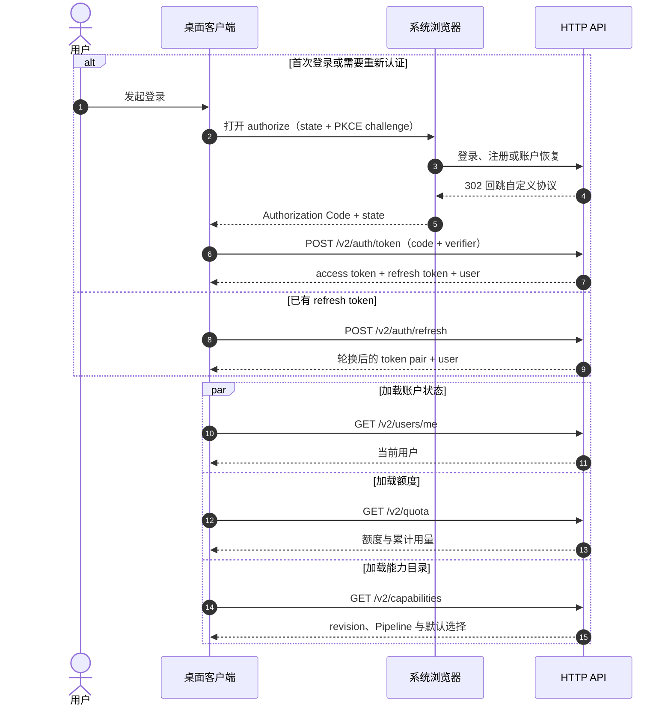
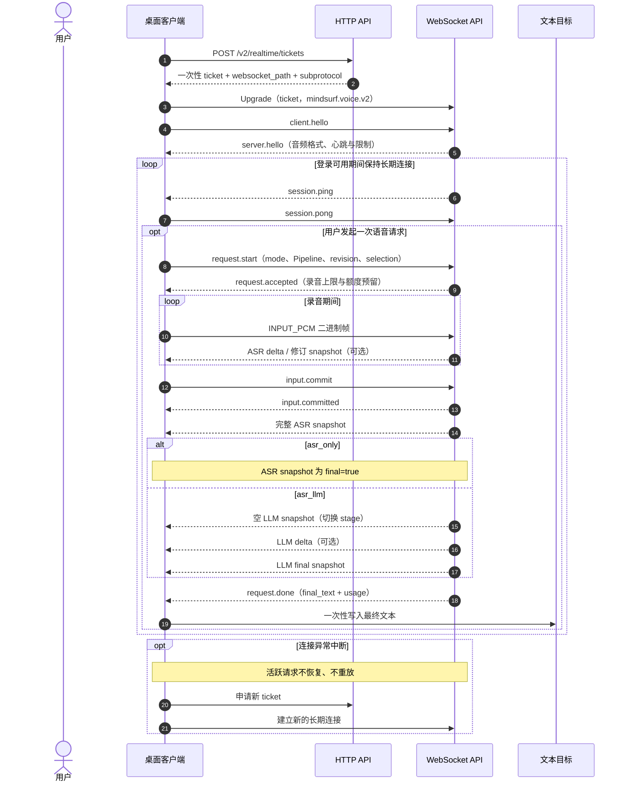

# MindSurf Voice API v2

本目录是 MindSurf Voice API v2 冻结版的统一规范入口。

```text
v2/
├── docs/          浏览器授权、额度、长期连接、请求状态和设计语义
├── openapi/       HTTP API 的 OpenAPI 3.1 契约
├── schemas/       WebSocket JSON 消息及共享类型的 JSON Schema
└── test-vectors/  JSON 正反例和输入音频二进制固定向量
```

## 产品边界

v2 只提供两种单轮模式：

- `asr_only`：ASR；
- `asr_llm`：ASR 后执行 LLM，作为一个完整流程。

两种模式都流式更新客户端临时文本区域：ASR 可以在录音期间返回增量和修订，asr_llm
还会在 ASR 完整结果后流式返回 LLM 文本。每个阶段都通过全量 snapshot 收口。只有最终
snapshot 和 `request.done` 都收到后，客户端才把临时文本一次性写入真实目标。

HTTP 通过系统浏览器和 PKCE 完成授权，并提供用户、额度、用量、能力发现和一次性 WS
ticket。客户端取得 Token 后立即建立 WebSocket，并在应用可用期间通过心跳保持长期连接；
录音请求复用该连接。注册、验证和账户恢复由浏览器认证站点处理。

v2 不包含 Assistant、多轮 Conversation、TTS、下行音频、音色或情绪能力。

## 通信协议概览

### 登录与初始化



### WebSocket 建连与请求



## 权威来源

| 内容 | 权威来源 |
|---|---|
| HTTP 路径、状态码和字段 | `openapi/openapi.yaml` |
| WS JSON 信封和 payload | `schemas/` |
| 输入音频二进制布局、连接和时序 | `docs/WS_PROTOCOL_V2.md` |
| 请求成功、降级、取消和断线 | `docs/request-lifecycle.md` |
| 跨语言固定输入 | `test-vectors/` |

## 文档入口

- [HTTP API v2](./docs/HTTP_API_V2.md)
- [WebSocket API v2](./docs/WS_PROTOCOL_V2.md)
- [Request 生命周期](./docs/request-lifecycle.md)
- [后端接入与交接](./docs/backend-integration.md)
- [OpenAPI](./openapi/openapi.yaml)
- [WebSocket Schemas](./schemas/README.md)
- [测试向量](./test-vectors/README.md)

v2 契约已于 2026-08-17 冻结。改变 mode、必填字段、HTTP 或 WebSocket public API、消息格式、
终态语义、鉴权方式或二进制布局均属于不兼容变更，必须提升主版本。
